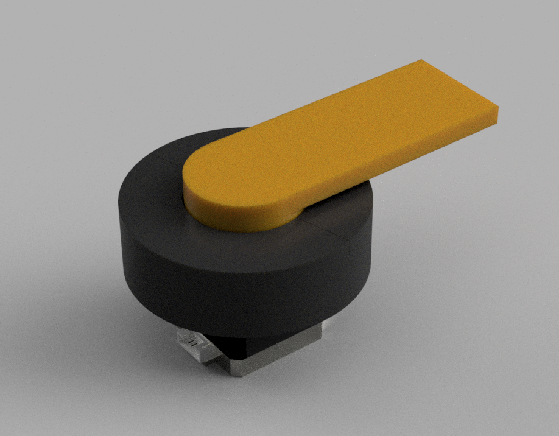

# Cycloidal Gearbox ⚙️

This is my cycloidal gearbox I built, and the python script I created to generate it! A cycloidal gearbox is a type of gearbox that allows you to turn rotational speed into torque. 

## Design Process

### Version 1

This gearbox was a handcranked gearbox specifically meant to test the validity of the python cycloidal generator. It had a gear ratio of 1:9. 

### Version 2

This design was a micro cycloidal gearbox with a ratio of 1:9, meant to only take up the same footprint as a NEMA 17. Due to the tight tolerances needed for a small cycloidal drive and the lack of precision offered by 3D printing, this design did not work.

### Version 3

This gearbox was the first working version to run on a NEMA 17. It has a larger footprint compared to Version 2 allowing greater tolerances and a fully functional design.

---

## 🛠️ The Python Script

This python script was based on the SolidWorks article *Building a Cycloidal Drive with SOLIDWORKS*. The two main parametric equations I used were: 

$$x = R \cos(t) - E \cos(N t) - r \cos(t + \psi), \quad y = R \sin(t) - E \sin(N t) - r \sin(t + \psi)$$
$$\psi = \text{atan2}\left(\sin((1 - N) t), \frac{R}{E \cdot N} - \cos((1 - N) t)\right)$$
Reduction ratio: **$1 : (N - 1)$** (rotor rotates opposite to input shaft).

### Installation & Execution
1. Clone the repo
2. Open Fusion 360 and launch **Scripts and Add-Ins** (`Shift + S`).
3. Under the **Scripts** tab, click **`+` (Plus)** to add a script.
4. Select the `cycloidal_generator` folder and click **Run**.

### Key Parameters
- **Pins ($N$) & Pitch Radius ($R$):** Sets outer stationary housing geometry (Rotor has $N-1$ lobes).
- **Eccentricity ($E$):** Input shaft offset distance. *(Constraint: $R > E \cdot N$)*.
- **Outer Pin Radius ($r$):** Roller pin radius. *(Constraint: validated against undercut limit $r_{\text{max}}$)*.
- **Precision / Profile Offset:** Angular step size and tolerance offset ($+$ for 3D print clearance).
- **Output Pins & Bolt Radius:** Defines concentric output pins and rotor clearance holes ($r_{\text{pin}} + E$).

---

## 🚀 Version 3 — Detailed Overview & Stats

> [!NOTE]  
> This section is dedicated to **Version 3**, whose CAD files can be found under `cad_models/version_3`.

### Key Specifications & Performance Stats

| Metric / Parameter | Value / Detail |
|---|---|
| **Gear Ratio** | 1:9 ($N=10$ outer pins, 9 rotor lobes) |
| **Outer Diameter** | 9.0 cm (90 mm) |
| **Drive Motor** | NEMA 17 Stepper Motor (42bygh40-A24dh)|
| **3D Printing Material** | PLA |
| **Primary Fasteners / Hardware** | 4× **M3 × 8 screws**, 2× **6704 Bearings** |
| **Tolerance Offset Applied** | +0.15 mm (+0.015 cm) all around|
| **Gearbox Torque** | 1.3 N·m ± 0.007 N·m |
| **Base NEMA 17 Torque** | 0.21 N·m ± 0.007 N·m |
| **Efficiency** | 66% ± 0.22% |

#### Further room for growth
1) The housing pins can be replaced with MR128 bearings allowing for less friction and higher efficiency in the gearbox.

2) The output pins can be replaced with M2 screws with metal coverings to increase rigidity, maximum torque output, and the efficiency of the gearbox.

#### Print Settings

The standard bambu labs settings with PLA for a P1S other than: 
minimum support x y: 1mm
support interference material: Bambu labs support PLA

